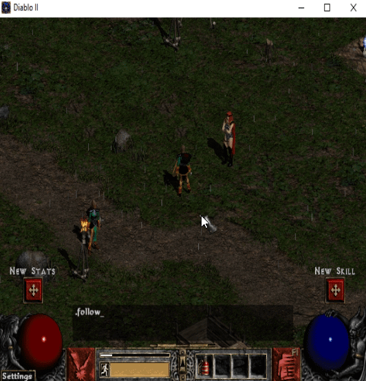
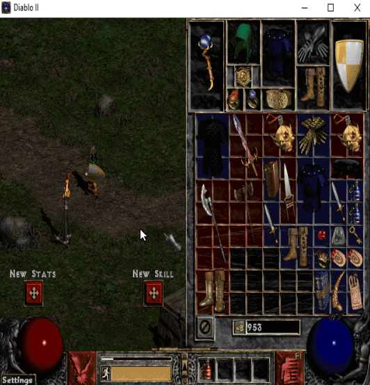

# AutoTathamet
[](http://npmjs.com/package/autotathamet)
[](https://circleci.com/gh/MephisTools/AutoTathamet)
[](https://discord.gg/9RqtApv)
[](https://gitpod.io/#https://github.com/MephisTools/AutoTathamet)

Create Diablo2 bots with a powerful, stable, and high level JavaScript API.



## Features

* chat
* follow
* pick up items

## Roadmap

* map
* inventory

## Usage

```js
const { createBot } = require('autotathamet')

async function start () {
  const bot = await createBot({
    host: 'battlenetIp',
    username: 'myUser',
    password: 'myPassword',
    version: '1.14',
    keyClassic: 'my16CharsKey',
    keyExtension: 'my16CharsKey'
  })
  await bot.selectCharacter('mycharacter')
  await bot.createGame('mygame', '', 'game server', 0)
}

start()

```

## Documentation

* See docs/API.md
